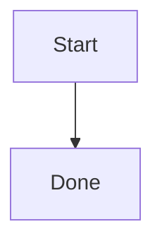

# Vidro CLI

## Overview

Use `vidro` as the first-party path to Vidro data when the CLI is installed in the shell.
Prefer this skill for direct note operations and lightweight verification.

## Quick Checks

Run these checks the first time you use `vidro` in a conversation, or when a `vidro` command fails unexpectedly:

```bash
vidro whoami
```

Use `which vidro` only when the command is missing or the shell cannot find it:

```bash
which vidro
```

If authentication is missing or expired, run:

```bash
vidro login
```

Use `--base-url` only when production is not the intended target. The default setup already points at `https://external-api.vidro.app`.

## Safe Workflow

### 1. Find the target before mutating

- Use `vidro search cards --query "..."` when the user refers to content rather than a card ID.
- Use `vidro cards get <card-id>` to confirm the exact card before updating it.
- Use `vidro boards list` when the user refers to a board by name.
- Use `vidro cards list --board-id <board-id>` when the user wants cards inside a specific board.
- Do not update a card based only on a fuzzy search hit. Search first, then read, then update.

### 2. Create new content

- Use Inbox by default.
- Create a board only when a new grouping is clearly needed.
- The card title is derived automatically from the beginning of the content, so put the intended heading first in the Markdown body.
- Do not pass `--title` to `vidro cards create`.

Examples:

```bash
vidro cards create --content "# Meeting notes"
vidro boards create --name "Agent Workspace"
vidro cards create --board-id <board-id> --content "# Spec draft"
```

### 3. Update existing content

- Use `vidro cards update <card-id> --title ... --content ...` for normal edits.
- Use `--inbox` to move a card back to Inbox.
- Do not pass `--board-id` and `--inbox` together.
- Read the current card first when the update depends on existing content.

Examples:

```bash
vidro cards update <card-id> --title "Updated title"
vidro cards update <card-id> --content "# Updated body"
vidro cards update <card-id> --board-id <board-id>
vidro cards update <card-id> --inbox
```

## Command Reference

Use these commands as the standard surface:

```bash
vidro whoami
vidro boards list
vidro boards create --name "..."
vidro cards list [--board-id <board-id>] [--limit 50]
vidro cards get <card-id>
vidro cards create [--board-id <board-id>] --content "..."
vidro cards update <card-id> [--title "..."] [--content "..."] [--board-id <board-id>] [--inbox]
vidro search cards --query "..." [--board-id <board-id>] [--limit 20]
```

Treat command output as JSON and read IDs from the response instead of reconstructing them.

## Multiline Content

When a card body is longer than a short sentence, use a heredoc or shell variable instead of fragile inline quoting.

```bash
content=$(cat <<'EOF'
# Daily note

- item 1
- item 2
EOF
)

vidro cards create --content "$content"
```

Use the same pattern for `vidro cards update`.

## Vidro Markdown Compatibility

When creating or updating card content, prefer Markdown that is known to render in Vidro's card viewer.

### Standard Markdown

Vidro renders Markdown through `react-markdown` with GFM and soft line breaks enabled. These forms are safe to use:

- Headings, paragraphs, blockquotes, horizontal rules.
- Ordered and unordered lists.
- Task lists such as `- [ ] todo` and `- [x] done`.
- Tables, strikethrough, autolinks, and footnotes from GFM.
- Inline code and fenced code blocks.
- Standard Markdown links and images.

Do not rely on raw HTML, MDX, math blocks, or frontmatter unless the repository implementation has been checked for that feature in the current task.

### Code blocks

Use fenced code blocks for code and diagrams.

Known highlighted languages include:

- `typescript`, `ts`, `tsx`
- `javascript`, `js`, `jsx`
- `json`, `bash`, `shell`
- `markdown`, `md`
- `yaml`, `yml`
- `sql`, `html`, `css`

Use ```mermaid fences for Mermaid diagrams. Vidro renders them through the dedicated Mermaid viewer.

````markdown

````

Use ```schedule fences for Vidro schedule panels.

````markdown
```schedule
range: 09:00-18:00
height: 720px
```
````

Schedule metadata supports these keys:

- Range: `range`, `visible-range`, `visiblerange`, `display-range`, `displayrange`.
- Start: `start`, `from`.
- End: `end`, `to`.
- Height: `height`, `min-height`, `minheight`.

Times use `HH:mm`. End time may be `24:00`. Height must be between `120` and `4000`, with optional `px`.

### Vidro-specific links

Vidro auto-linkifies plain text custom protocol URLs for:

- `vidro://...`
- `raycast://...`
- `kindle://...`

These protocols are also allowed in normal Markdown links.

Useful Vidro link shapes:

```markdown
[Card](vidro://boards/<board-id>?card=<card-id>)
[Inbox card](vidro://inbox?card=<card-id>)
[Attachment](vidro://uploads/<upload-id>)

```

`vidro://uploads/<upload-id>` is resolved as a file download when used as a link, and as an uploaded image when used as an image source.

### Link previews

A level-1 heading whose only content is an HTTP(S) Markdown link is rendered as a rich link preview.

```markdown
# [Example](https://example.com)
```

Twitter/X status URLs in that same shape render as embedded tweets when supported by the viewer.

## Guardrails

- Assume `vidro search cards` is retrieval, not proof. Confirm important hits with `vidro cards get`.
- Assume `vidro cards list` without `--board-id` means Inbox.
- Do not invent delete, archive, or restore commands. They are not in the current CLI surface.
- Surface CLI error messages directly when a command fails.
- Prefer creating a new Inbox note over overwriting an unrelated card when intent is ambiguous.

## Typical Patterns

### Search and answer from notes

1. Run `vidro search cards --query "..."`.
2. Pick the best candidate.
3. Run `vidro cards get <card-id>`.
4. Answer only after confirming the actual content.

### Save a new memo

1. Draft the Markdown body locally, and put the intended title at the top because it will be derived from the content.
2. Run `vidro cards create --content "$content"`.
3. Report the returned `card.id` when traceability matters.

### Amend an existing note

1. Search or fetch the exact card.
2. Read the current body.
3. Build the full next body deliberately.
4. Run `vidro cards update <card-id> --content "$content"`.
